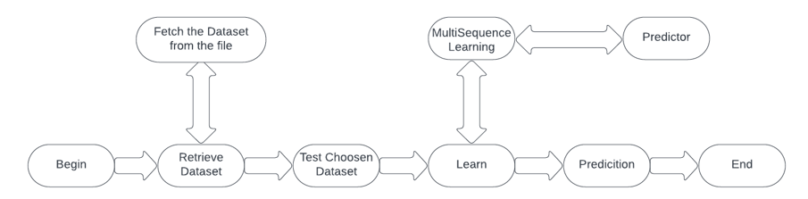
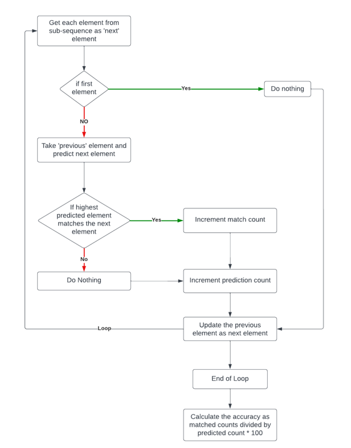

# ML23/24-09   Approve Prediction of Multisequence Learning 

## Introduction

In this project, we attempted to build new ways using the 'MultisequenceLearning' algorithm. The new methods automatically read the dataset from the supplied path in 'HelperMethods.ReadDataset(datasetPath)'. We also have test data in another file that has to be read for later testing the subsequences in a similar format to 'HelperMethods.ReadDataset(testsetPath)'. 'RunMultiSequenceLearningExperiment(sequences, sequencesTest)' accepts the numerous sequences in'sequences' and the test subsequences in'sequencesTest' and passes them to 'RunMultiSequenceLearningExperiment(sequences, sequencesTest)'. After the learning process is done, the predicted element's accuracy is calculated. 
## Implementation



Fig: Architecture of Approve Prediction of Multisequence Learning

Above our project's implementation flow.

The model used to process and store the dataset is called `Sequence`. And as shown below:

```csharp
public class Sequence
{
    public String name { get; set; }
    public int[] data { get; set; }
}
```

eg:
- Dataset

```json
[
  {
    "name": "S1",
    "data": [ 0, 2, 5, 6, 7, 8, 10, 11, 13 ]
  },
  {
    "name": "S2",
    "data": [ 1, 2, 3, 4, 6, 11, 12, 13, 14 ]
  },
  {
    "name": "S3",
    "data": [ 1, 2, 3, 4, 7, 8, 10, 12, 14 ]
  }
]
```

- Test Dataset

```json
[
  {
    "name": "T1",
    "data": [ 1, 2, 4 ]
  },
  {
    "name": "T2",
    "data": [ 2, 3, 4 ]
  },
  {
    "name": "T3",
    "data": [ 4, 5, 7 ]
  },
  {
    "name": "T4",
    "data": [ 5, 8, 9 ]
  }
]

```


Our implemented methods are in `HelperMethod.cs` and can be found [here](../HelperMethods.cs):

1. FetchHTMConfig()

We save the HTMConfig, which is utilized for Hierarchical Temporal Memory, to 'Connections'.

```csharp
/// <summary>
/// HTM Config for creating Connections
/// </summary>
/// <param name="inputBits">input bits</param>
/// <param name="numColumns">number of columns</param>
/// <returns>Object of HTMConfig</returns>
public static HtmConfig FetchHTMConfig(int inputBits, int numColumns)
{
    HtmConfig cfg = new HtmConfig(new int[] { inputBits }, new int[] { numColumns })
    {
        Random = new ThreadSafeRandom(42),

        CellsPerColumn = 25,
        GlobalInhibition = true,
        LocalAreaDensity = -1,
        NumActiveColumnsPerInhArea = 0.02 * numColumns,
        PotentialRadius = (int)(0.15 * inputBits),
        MaxBoost = 10.0,
        DutyCyclePeriod = 25,
        MinPctOverlapDutyCycles = 0.75,
        MaxSynapsesPerSegment = (int)(0.02 * numColumns),
        ActivationThreshold = 15,
        ConnectedPermanence = 0.5,e.
        PermanenceDecrement = 0.25,
        PermanenceIncrement = 0.15,
        PredictedSegmentDecrement = 0.1,
    };

    return cfg;
}
```

All of the fields are self-explanatory according to HTM theory.

2. getEncoder()

We used 'ScalarEncoder' because we were encoding solely numeric values.

Remember, 'inputBits' is the same as 'HTMConfig'.


```csharp
/// <summary>
/// Get the encoder with settings
/// </summary>
/// <param name="inputBits">input bits</param>
/// <returns>Object of EncoderBase</returns>
public static EncoderBase GetEncoder(int inputBits)
{
        double max = 20;

        Dictionary<string, object> settings = new Dictionary<string, object>()
        {
        { "W", 15},
        { "N", inputBits},
        { "Radius", -1.0},
        { "MinVal", 0.0},
        { "Periodic", false},
        { "Name", "scalar"},
        { "ClipInput", false},
        { "MaxVal", max}
        };

        EncoderBase encoder = new ScalarEncoder(settings);

        return encoder;
}
```
Keep in mind that the `MaxValue` for the encoder is set to `20`, which can be changed but must be matched when producing the synthetic dataset.

3. ReadDataset()

When supplied as a whole path, this function reads the JSON file and returns an object from the `Sequence` list.

```csharp
/// <summary>
/// Reads dataset from the file
/// </summary>
/// <param name="path">full path of the file</param>
/// <returns>Object of list of Sequence</returns>
public static List<Sequence> ReadDataset(string path)
{
        Console.WriteLine("Reading Sequence...");
        String lines = File.ReadAllText(path);
        //var sequence = JsonConvert.DeserializeObject(lines);
        List<Sequence> sequence = System.Text.Json.JsonSerializer.Deserialize<List<Sequence>>(lines);

        return sequence;
}
```

4. CreateDataset()


By automating the process, we have improved our approach to creating datasets by doing away with the necessity for laborious manual involvement. With this enhanced method, datasets are created according to predefined criteria. These are size, which establishes the length of each sequence, startVal and endVal, which set the beginning and finishing range values for the sequences, and numberOfSequence, which establishes the number of sequences to be constructed. This simplified process improves dataset generating accuracy and efficiency.

```csharp
/// <summary>
/// Creates a list of Sequence as per configuration
/// </summary>
/// <returns>Object of list of Sequence</returns>
public static List<Sequence> CreateDataset()
{
        int numberOfSequence = 3;
        int size = 12;
        int startVal = 0;
        int endVal = 15;
        Console.WriteLine("Creating Sequence...");
        List<Sequence> sequence = HelperMethods.CreateSequences(numberOfSequence, size, startVal, endVal);

        return sequence;
}
```
Keep in mind that {endVal} needs to be smaller than {MaxVal} of the `ScalarEncoder` that was used previously.

5. SaveDataset()

Stores the dataset in the application's running application's `dataset` directory under the `BasePath}.


```csharp
/// <summary>
/// Saves the dataset in the 'dataset' folder in BasePath of the application
/// </summary>
/// <param name="sequences">Object of list of Sequence</param>
/// <returns>Full path of the dataset</returns>
public static string SaveDataset(List<Sequence> sequences)
{
        string BasePath = AppDomain.CurrentDomain.BaseDirectory;
        string reportFolder = Path.Combine(BasePath, "dataset");
        if (!Directory.Exists(reportFolder))
        Directory.CreateDirectory(reportFolder);
        string reportPath = Path.Combine(reportFolder, $"dataset_{DateTime.Now.Ticks}.json");

        Console.WriteLine("Saving dataset...");

        if (!File.Exists(reportPath))
        {
        using (StreamWriter sw = File.CreateText(reportPath))
        {
          sw.WriteLine(JsonConvert.SerializeObject(sequences));
        }
        }

        return reportPath;
}
```
6. Calculating accuracy in PredictNextElement() in `Program.cs`



Fig: Predictions and calculating accuracy

```csharp
int matchCount = 0;
int predictions = 0;
double accuracy = 0.0;

foreach (var item in list)
{
    Predict();
    //compare current element with prediction of previous element
    if(item == Int32.Parse(prediction.Last()))
    {
        matchCount++;
    }
    predictions++;
    accuracy = (double)matchCount / predictions * 100;
}
```

Observe that there is no prediction code.

## How to run the project

### To produce a synthetic dataset

1. First, open the [sln](../../../NeoCortexApi.sln) and choose the `MultiSequenceLearning` as startup project.

2. The `Main()` is located in `Program.cs`. To generate a synthetic dataset, remove the comments from the code below.

```csharp
//to create a synthetic dataset
string path = HelperMethods.SaveDataset(HelperMethods.CreateDataset());
Console.WriteLine($"Dataset saved: {path}");
```

*And comment the remaining lines*.

3. Run to create the dataset and save the path of the dataset folder and name.


### To run the experiment

1. Select `MultiSequenceLearning} as the startup project when you open [NeoCortexApi.sln](../../../NeoCortexApi.sln).

2. The `Main()` is located in `Program.cs`. As you can see below, rename the `dataset` file that was saved from the last run:

```csharp
//to read dataset
string BasePath = AppDomain.CurrentDomain.BaseDirectory;
string datasetPath = Path.Combine(BasePath, "dataset", "dataset_03.json"); //edit name of dataset here
Console.WriteLine($"Reading Dataset: {datasetPath}");
List<Sequence> sequences = HelperMethods.ReadDataset(datasetPath);
```

additionally, *copy the [test data](../dataset/TestDatasets1.json) to the folder*
(`{BASEPATH}\neocortexapi\source\MySEProject\MultiSequenceLearning\bin\Debug\net6.0\dataset`).

## Results
We have used a range of datasets to do as much experimentation as is practical. We purposely kept the dataset sizes small and the sequence lengths short in order to account for the significant execution time.
.jpeg)

## Reference

- Forked from [ddobric/neocortexapi](https://github.com/ddobric/neocortexapi)

- [Numenta Research Publication](https://www.numenta.com/resources/research-publications/) 

- [Machine Learning Guide to HTM](https://www.numenta.com/blog/2019/10/24/machine-learning-guide-to-htm/)
